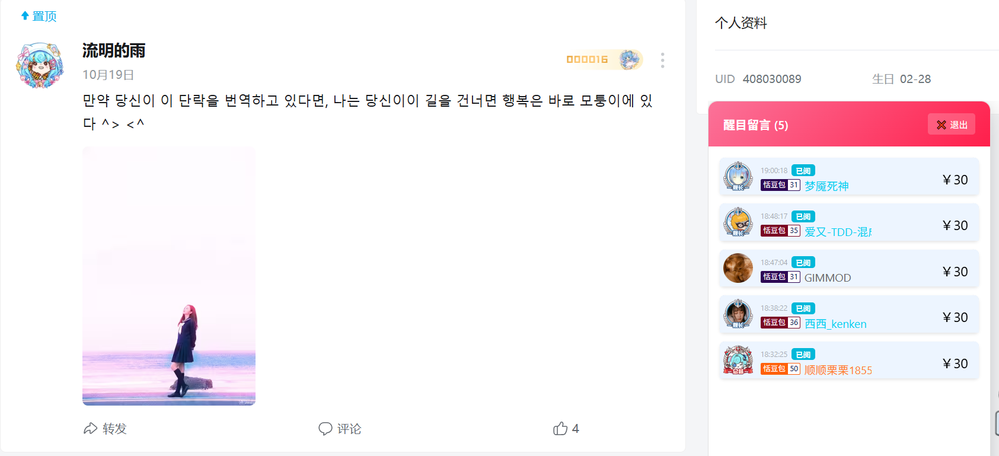

# 💻 Bilibili Super Chat Monitor Desktop

一个基于 **Electron** 框架，结合 **tiny-bilibili-ws** 库深度定制的 B站直播醒目留言（Super Chat, SC）实时监控桌面应用。本项目彻底解决了 B站 WebSocket **风控、频繁断连**以及**数据解析层级错误**等关键问题，确保稳定监听。

## ✨ 主要特性

* **稳定连接：** 采用社区专业库 `tiny-bilibili-ws`，并通过传入 **Cookie/UID** 认证，有效绕过 B站严格的连接风控机制。
* **隐私安全：** 使用 `.gitignore` 忽略本地 `config.js` 文件，确保您的 Cookie/UID 等敏感信息**不会**被上传到 GitHub。
* **实时监听：** 快速、稳定地接收特定房间的 `SUPER_CHAT_MESSAGE` 事件并实时渲染到独立窗口。
* **轻量化：** Electron 独立窗口，不依赖浏览器环境，专注于 SC 消息的接收与展示。

## 📸 运行截图 (Placeholder)

## 🛠️ 技术栈

* **核心语言：** Node.js / JavaScript
* **桌面框架：** [Electron](https://www.electronjs.org/)
* **WebSocket 库：** [tiny-bilibili-ws](https://www.npmjs.com/package/tiny-bilibili-ws)

## 💡 开发历程回顾

本项目从一个手动编写 WebSocket 协议的尝试开始，经历了多次重要的技术挑战，最终得以稳定运行：

1.  **风控突破：** 首次尝试手动协议失败后，引入 `Origin` 和 `User-Agent` 头部。在 Cookie 方案失败后，最终决定切换到 `tiny-bilibili-ws` 库，并结合有效的 `Cookie` 和 `UID` 成功突破连接风控。
2.  **数据结构修正：** 解决了 `tiny-bilibili-ws` 在 `SUPER_CHAT_MESSAGE` 事件中，数据体嵌套层级过深的问题（`data.data.data`），并增加了健壮的检查机制，避免程序因非 SC 消息而崩溃。
3.  **安全隔离：** 引入 `.gitignore` 和 `config.js` 配置文件，彻底解决了本地敏感信息（Cookie）的泄露风险。

## 🚀 如何运行

### 1. 克隆项目

将本项目克隆到您的本地：

    // git clone YOUR_REPO_URL
       cd Bilibili-SC-Monitor-Desktop

### 2. 安装依赖

    // npm install

### 3. 配置 B站认证（敏感信息隔离）

a. 创建配置文件： 将根目录下的 config.example.js 文件复制并重命名为 config.js。

b. 填写信息： 打开 config.js，将 USER_COOKIE 和 USER_UID 替换为您从 B站获取的实际值。

    // config.js
       module.exports = {
       USER_COOKIE: '在此填写您从B站网页获取的完整Cookie字符串', // ⬅️ 必须填写，否则可能无法连接
       USER_UID: 0,   // 请填写您的 B站用户UID
       };

### 4. 运行应用

    // npm start

## 📄 核心代码解析
我们通过调整 SUPER_CHAT_MESSAGE 事件监听器，确保只处理有效的 SC 消息，并使用 data.data.data 访问真正的 SC 数据：
// renderer/renderer.js (核心逻辑片段)
liveInstance.on('SUPER_CHAT_MESSAGE', (data) => {
    
    // 检查 data.data.data 是否存在 (这是真正的 SC 数据)
    if (data && data.data && data.data.data && data.data.data.user_info && data.data.data.price > 0) {
        
        console.log(`[WS] 💰 收到新留言: ￥${data.data.data.price} - ${data.data.data.user_info.uname}`);
        
        update_sc_item(data.data.data); 
        
    } else {
        console.log("[WS] 收到一条非 SC 消息 (如删除或列表更新)，已忽略。", data);
    }
    });

## 💖 贡献与致谢
感谢 tiny-bilibili-ws 开发者提供的稳定 WebSocket 解决方案。

欢迎提交 Issue 和 Pull Request 来改进 UI 或增加持久化存储等功能。
